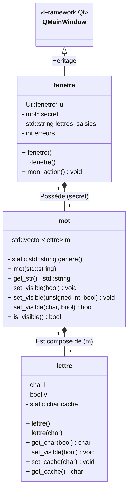
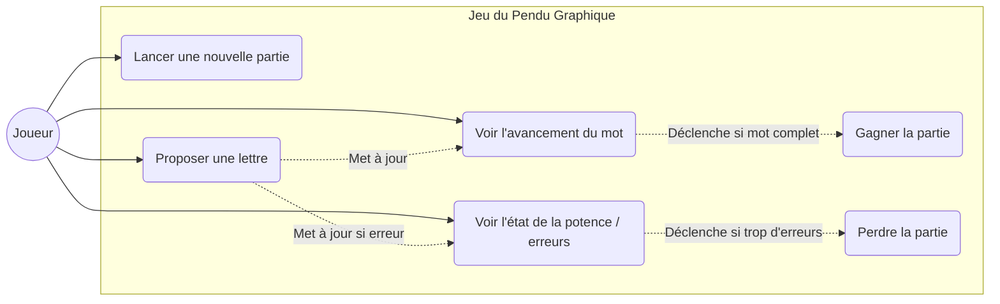

# Diagrammes du projet Pendu Graphique

## Diagramme de Classes

Ce diagramme représente la structure statique des classes et leurs relations (Héritage, Composition, Association).

## Diagramme des Cas d'Utilisation

Ce diagramme représente les interactions de l'utilisateur (le Joueur) avec l'interface graphique du jeu du Pendu.

